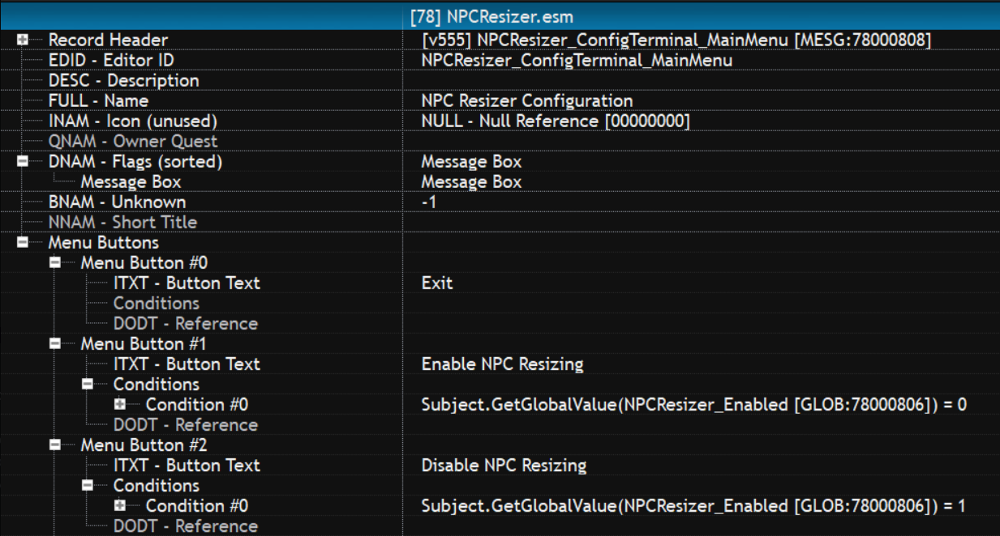

# Message Records

## Troubleshooting
- If being displayed with .Show() the Message Record must have the MessageBox flag or it fails to display with no errors at all.

## Known issues
- The "Smooth UI" class of mods screw with the notification speed so the default of 2s at 60FPS is like .5s and at 120FPS if it tries it usually crashes. The game engine loops seems tied the FPS for some lame reason. Also > 10s seems to stop increasing the delay before close. The engine seems to have a max delay.

## Example

### XEdit 



### Papyrus
Below is the code to display and process the config menu in the xEdit image...

```
Event OnEffectStart(ObjectReference akTarget, Actor akCaster, MagicEffect akBaseEffect, Float afMagnitude, Float afDuration)
  If (akTarget == PlayerRef as ObjectReference)
    PlayerRef.AddItem(NPCResizer_ConfigTerminal, 1, True) ;; Need to replace the item we just consumed to trigger the menu
    Self.ProcessMenu(NPCResizer_ConfigTerminal_MainMenu, -1, True)
  EndIf
EndEvent

Function ProcessMenu(Message message, Int menuButtonClicked, Bool menuActive)
  While (menuActive)
    If (message == NPCResizer_ConfigTerminal_MainMenu)
      menuButtonClicked = NPCResizer_ConfigTerminal_MainMenu.Show(0.0, 0.0, 0.0, 0.0, 0.0, 0.0, 0.0, 0.0, 0.0)
      If (menuButtonClicked == 0)
        ;; CLICKED 0: Close Menu Clicked
        menuActive = False
      ElseIf (menuButtonClicked == 1)
        ;; CLICKED 1: Enable NPC Resizing
        VPI_Debug.DebugMessage(Venpi_ModName, "NPCResizer_ConfigTerminalScript", "ProcessMenu", "Main Menu Button 1 Clicked - Enabling NPC Resize.", 0, Venpi_DebugEnabled.GetValueInt())
        message = NPCResizer_ConfigTerminal_MainMenu
        NPCResizer_Enabled.SetValueInt(1)
      ElseIf (menuButtonClicked == 2)
        ;; CLICKED 2: Disable NPC Resizing
        VPI_Debug.DebugMessage(Venpi_ModName, "NPCResizer_ConfigTerminalScript", "ProcessMenu", "Main Menu Button 2 clicked - Disabling NPC Resize.", 0, Venpi_DebugEnabled.GetValueInt())
        message = NPCResizer_ConfigTerminal_MainMenu
        NPCResizer_Enabled.SetValueInt(0)
      EndIf
    EndIf ;; End Main Menu
  EndWhile
EndFunction
```