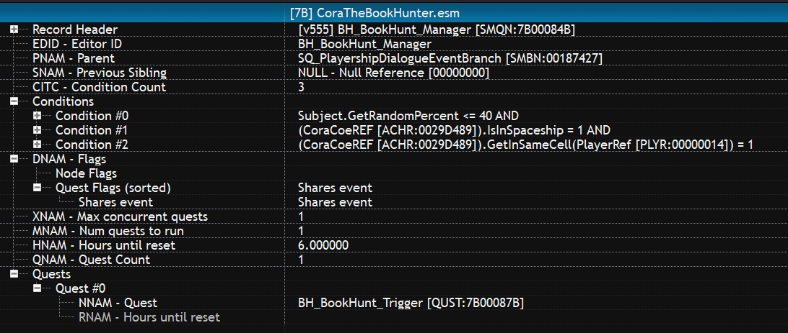
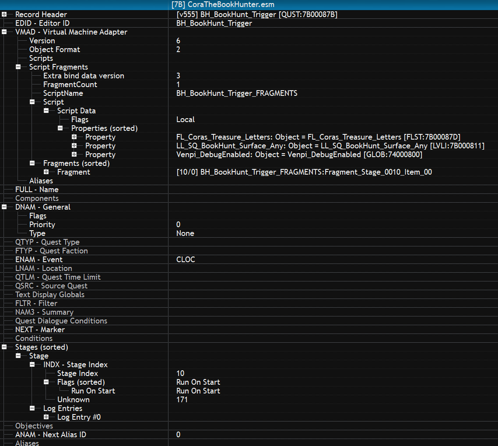

# Quests - Triggers

Triggering quests via starts enabled doesn't work outside of hidden init type quests because quest conditions are not checked so for the player they go active immediately. 

Other then the barker quests/skits which require voice files to play, using Story Manage Quest Node and a CLOC event quest seems to be the best way to trigger quests. Another options is open world spawn items that script side trigger quests.

## Example CLOC Trigger

Below is a fully setup quest trigger chain using the story manager CLOC event.

### xEdit



### Papyrus
```
ScriptName BH_BookHunt_Trigger_FRAGMENTS Extends Quest

;;;;;;;;;;;;;;;;;;;;;;;;;;;;;;;;;;;;;;;;;;;;;;;;;;;;;;;;;;;;;;;;;;;;;
;;;
;;; Global Variables
;;;
GlobalVariable Property Venpi_DebugEnabled Auto Const Mandatory
String Property Venpi_ModName="CoraTheBookHunter" Auto Const Mandatory

;;;;;;;;;;;;;;;;;;;;;;;;;;;;;;;;;;;;;;;;;;;;;;;;;;;;;;;;;;;;;;;;;;;;;
;;;
;;; Properties
;;;
FormList Property FL_Coras_Treasure_Letters Auto Const Mandatory
LeveledItem Property LL_SQ_BookHunt_Surface_Any Auto Const Mandatory

;;;;;;;;;;;;;;;;;;;;;;;;;;;;;;;;;;;;;;;;;;;;;;;;;;;;;;;;;;;;;;;;;;;;;
;;;
;;; Fragments
;;;
Function Fragment_Stage_0010_Item_00()
  VPI_Debug.DebugMessage(Venpi_ModName, "BH_BookHunt_Trigger_FRAGMENTS", "Fragment_Stage_0010_Item_00", "Book Hunt Trigger Quest Fired.", 0, Venpi_DebugEnabled.GetValueInt())
  Actor PlayerRef = Game.GetPlayer()
  Message letter = FL_Coras_Treasure_Letters.GetAt(Utility.RandomInt(0, FL_Coras_Treasure_Letters.GetSize())) as Message
  letter.Show(0.0, 0.0, 0.0, 0.0, 0.0, 0.0, 0.0, 0.0, 0.0)
  PlayerRef.AddItem(LL_SQ_BookHunt_Surface_Any as Form, 1, true)
  ; Self.Stop()
  ; Self.Reset()
  ; Self.Start()
EndFunction
```

